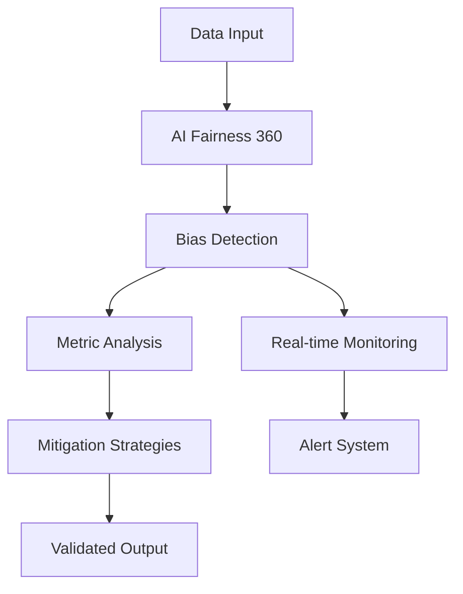
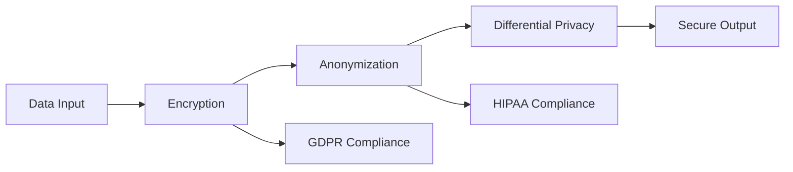
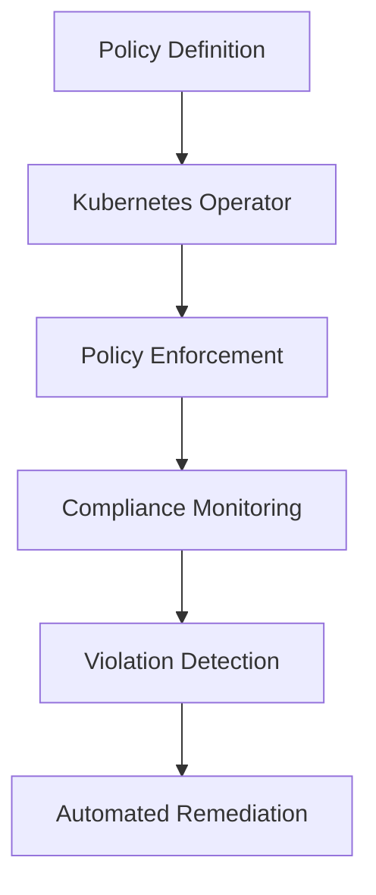
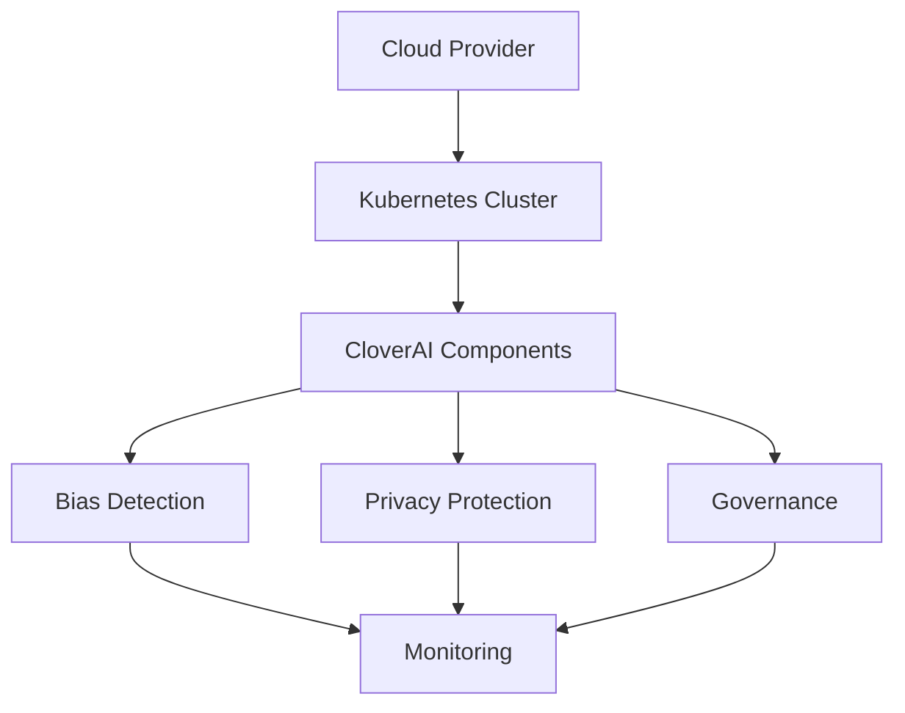

# CloverAI Technical Overview: Ethical AI Architecture

## Architecture Overview

CloverAI implements a robust, layered architecture designed to ensure ethical AI deployment in cloud environments through automated governance, continuous monitoring, and proactive bias mitigation.

### Core Components

#### 1. Bias Detection Engine


**Implementation Details:**
- Leverages AI Fairness 360 for comprehensive bias detection
- Implements multiple fairness metrics (demographic parity, equal opportunity)
- Real-time bias monitoring and alerting
- Automated mitigation through reweighing and disparate impact removal

#### 2. Privacy Protection Layer


**Key Features:**
- AES-GCM encryption for sensitive data
- Multi-level anonymization strategies
- Differential privacy implementation
- Automated compliance checking for GDPR/HIPAA

#### 3. Governance Automation System


**Core Capabilities:**
- Dynamic policy enforcement
- Real-time compliance monitoring
- Automated violation remediation
- Comprehensive audit logging

### Technical Implementation

#### 1. Monitoring Infrastructure
```python
# Example Prometheus metric configuration
metrics = {
    'bias_score': Gauge('ai_model_bias_score', 'Model bias measurement'),
    'privacy_compliance': Counter('privacy_violations', 'Privacy violations detected'),
    'policy_enforcement': Histogram('policy_enforcement_latency', 'Policy enforcement time')
}
```

#### 2. Security Controls
```yaml
# Network Policy Example
apiVersion: networking.k8s.io/v1
kind: NetworkPolicy
metadata:
  name: cloverai-security
spec:
  podSelector:
    matchLabels:
      app: cloverai
  policyTypes:
  - Ingress
  - Egress
```

### Data Flow and Processing

1. **Input Layer**
   - Data validation and sanitization
   - Schema enforcement
   - Initial quality checks

2. **Processing Layer**
   ```mermaid
   graph LR
       A[Input] --> B[Validation]
       B --> C[Bias Check]
       C --> D[Privacy Protection]
       D --> E[Policy Enforcement]
       E --> F[Output]
   ```

3. **Output Layer**
   - Compliance validation
   - Audit trail generation
   - Transparency reporting

### Deployment Architecture



### Performance Considerations

1. **Scalability**
   - Horizontal scaling through Kubernetes
   - Distributed processing capabilities
   - Load balancing configuration

2. **Reliability**
   ```yaml
   # Example resource configuration
   resources:
     limits:
       cpu: "2"
       memory: "4Gi"
     requests:
       cpu: "500m"
       memory: "1Gi"
   ```

3. **High Availability**
   - Multi-zone deployment
   - Automated failover
   - Data replication

### Security Measures

1. **Data Protection**
   - End-to-end encryption
   - Secure key management
   - Access control policies

2. **Network Security**
   - Pod security policies
   - Network isolation
   - TLS enforcement

3. **Compliance**
   - Automated compliance checking
   - Regular policy updates
   - Audit trail maintenance

### Monitoring and Alerting

1. **Metrics Collection**
   ```yaml
   # Prometheus scrape configuration
   scrape_configs:
     - job_name: 'cloverai'
       metrics_path: '/metrics'
       static_configs:
         - targets: ['localhost:8000']
   ```

2. **Alert Configuration**
   - Bias threshold alerts
   - Privacy violation notifications
   - Policy compliance warnings

3. **Dashboarding**
   - Real-time monitoring
   - Trend analysis
   - Performance metrics

### Future Roadmap

1. **Technical Enhancements**
   - Advanced bias detection algorithms
   - Enhanced privacy preservation techniques
   - Expanded governance automation

2. **Integration Capabilities**
   - Additional cloud provider support
   - Extended monitoring capabilities
   - Enhanced reporting features

### Conclusion

CloverAI's architecture provides a comprehensive framework for ethical AI deployment, combining automated governance, continuous monitoring, and proactive protection measures. The system's modular design ensures scalability and adaptability while maintaining strict compliance with regulatory requirements.

For detailed implementation guidelines and best practices, refer to the project documentation at [GitHub Repository](https://github.com/shankypedia/CloverAI).
